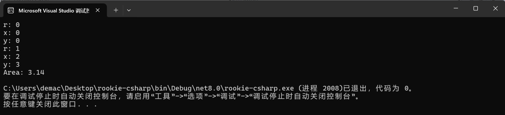
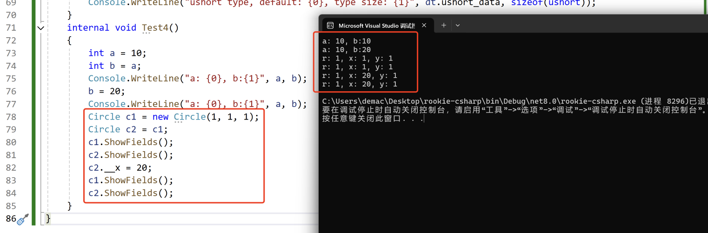

# rookie-csharp

学习入门csharp的记录

**参考: [https://www.runoob.com/csharp/csharp-tutorial.html](https://www.runoob.com/csharp/csharp-tutorial.html)**

C#的构想很接近C++，但是它和JAVA更相似，因为我是写C++比较多，所以这个记录会记录我对C#的，从C++角度的一些理解。

如果想通过本文档学习了解C#，需要先熟练编写C++代码，理解面向对象编程思想。

本文档提供简单入门，深入了解需要通过项目来学习，通过本文档是不够的。

## 环境

- **[Visual Studio](https://visualstudio.microsoft.com/)**

***

下面代码在文件`Lesson1.cs`中。

## 简单入门

首先我用的目录结构:

`src` 里面是每一章节的代码 `Lessonx.cs`。

`Main.cs`:

```cs
// program entry
namespace rookie_csharp
{
    class Run
    {
        static void Main(string[] args)
        {
            Lesson1 t1 = new Lesson1();
            t1.Test1();
        }
    }
}
```

然后在`Src/Lesson1.cs`里定义一些类和接口。

**先来打印一个`hello world`.**

```cs
using System;
using System.Collections.Generic;
using System.Linq;
using System.Text;
using System.Threading.Tasks;
internal class Lesson1
{
    internal void Test1()
    {
        // print an hello world
        Console.WriteLine("hello world");
        Console.ReadKey();
    }
}
```

程序的第一行 `using System;` - `using` 关键字用于在程序中包含 `System` 命名空间。 一个程序一般有多个 `using` 语句, 相当于C++的 `using namespace std;`

后面`Test1`就是一个函数了，和C++一样，如果不是`static`方法，需要创建对象才能调用，如果是`static`方法，可以直接通过类名调用。

```csharp
Console.WriteLine("hello world");
```

就是打印语句，`Console`是System命名空间的，要包含上才能用。

```csharp
Console.ReadKey();
```

是针对于VSStudio的，防止命令行快速闪退。

> [!NOTE]
>
> - C# 是大小写敏感的。
> - 所有的语句和表达式必须以分号（;）结尾。
> - 程序的执行从 Main 方法开始。
> - 与 Java 不同的是，文件名可以不同于类的名称。

**编写一个简单的类**

```cs
internal class Lesson1
{
    internal class Circle
    {
        public int __r;
        public int __x;
        public int __y;
        public Circle() { }
        public Circle(int r, int x, int y)
        {
            this.__r = r;
            __x = x;
            __y = y;
        }
        public double Area() { return 3.14 * __r * __r; }
        public void ShowFields()
        {
            Console.WriteLine("r: {0}", __r);
            Console.WriteLine("x: {0}", __x);
            Console.WriteLine("y: {0}", __y);
        }
    }
    internal void Test1()
    {
        // print an hello world
        Console.WriteLine("hello world");
        Console.ReadKey();
    }
    internal void Test2() {
        Circle cir = new Circle();
        cir.ShowFields();
        Circle cir2 = new Circle(1, 2, 3);
        cir2.ShowFields();
        Console.WriteLine("Area: {0}", cir2.Area());
    }
}
```



只要会一门面向对象语言其实上面的代码都是很好懂的。

> [!TIP]
>
> - 构造函数要带上`public`不然外面访问不到（细节还没学，后面会详细学）
> - 和C++一样，如果显示编写了构造函数，默认构造就不会自动构造，需要提供无参的构造，不然就不能用`new Circle()`来构造。
> - 如果不初始化字段，会调用自己的构造函数。上面的`int`就会默认构造为0。

## 顶级语句

一句话：可以想像写Python一样写。

**特点：**

- **无需类或方法**：顶级语句允许你直接在文件的顶层编写代码，无需定义类或方法。
- **文件作为入口点**：包含顶级语句的文件被视为程序的入口点，类似于 C# 之前的 `Main` 方法。
- **自动 `Main` 方法**：编译器会自动生成一个 `Main` 方法，并将顶级语句作为 `Main` 方法的主体。
- **支持局部函数**：尽管不需要定义类，但顶级语句的文件中仍然可以定义局部函数。
- **更好的可读性**：对于简单的脚本或工具，顶级语句提供了更好的可读性和简洁性。
- **适用于小型项目**：顶级语句非常适合小型项目或脚本，可以快速编写和运行代码。
- **与现有代码兼容**：顶级语句可以与现有的 C# 代码库一起使用，不会影响现有代码。

> [!WARNING]
>
> - **文件限制：**顶级语句只能在一个源文件中使用。如果在一个项目中有多个使用顶级语句的文件，会导致编译错误。
> - **程序入口：**如果使用顶级语句，则该文件会隐式地包含 Main 方法，并且该文件将成为程序的入口点。
> - **作用域限制：**顶级语句中的代码共享一个全局作用域，这意味着可以在顶级语句中定义的变量和方法可以在整个文件中访问。

```cs
Console.WriteLine("top level statement");
int a = 10;
var b = 20;
Console.WriteLine("a: {0}, b:{1}, a+b:{2}", a, b, a + b);
SayHello.Say(); // static方法用类名调用
class SayHello
{
    public static void Say() { Console.WriteLine("hello"); }
}
// program entry
#if false
namespace rookie_csharp
{
    class Run
    {
        static void Main(string[] args)
        {
            Lesson1 t1 = new Lesson1();
            t1.Test2();
        }
    }
}
#endif
```


- `var`跟`auto`一样，推导类型
- `Console.WriteLine("a: {0}, b:{1}, a+b:{2}", a, b, a + b);`就是可变参数，跟`printf`一个道理，012表示第123个参数，看例子就能懂
- 可以像C++一样用条件编译

## 类型

### 值类型

```cs
internal class DataType {
    public bool bool_data;
    public byte byte_data;
    public char char_data;
    public decimal decimal_data;
    public double double_data;
    public float float_data;
    public int int_data;
    public long long_data;
    public sbyte sbyte_data;
    public short short_data;
    public uint uint_data;
    public ulong ulong_data;
    public ushort ushort_data;
}
internal void Test3()
{
    // 数据类型
    DataType dt = new DataType();
    Console.WriteLine("bool type, default: {0}, type size: {1}", dt.bool_data, sizeof(bool));
    Console.WriteLine("byte type, default: {0}, type size: {1}", dt.byte_data, sizeof(byte));
    Console.WriteLine("char type, default: {0}, type size: {1}", dt.char_data, sizeof(char));
    Console.WriteLine("decimal type, default: {0}, type size: {1}", dt.decimal_data, sizeof(decimal));
    Console.WriteLine("double type, default: {0}, type size: {1}", dt.double_data, sizeof(double));
    Console.WriteLine("float type, default: {0}, type size: {1}", dt.float_data, sizeof(float));
    Console.WriteLine("int type, default: {0}, type size: {1}", dt.int_data, sizeof(int));
    Console.WriteLine("long type, default: {0}, type size: {1}", dt.long_data, sizeof(long));
    Console.WriteLine("sbyte type, default: {0}, type size: {1}", dt.sbyte_data, sizeof(sbyte));
    Console.WriteLine("short type, default: {0}, type size: {1}", dt.short_data, sizeof(short));
    Console.WriteLine("uint type, default: {0}, type size: {1}", dt.uint_data, sizeof(uint));
    Console.WriteLine("ulong type, default: {0}, type size: {1}", dt.ulong_data, sizeof(ulong));
    Console.WriteLine("ushort type, default: {0}, type size: {1}", dt.ushort_data, sizeof(ushort));
}
```

通过程序运行结果就可以得出每一种变量的默认值和变量的空间占的大小。


**变量的范围: [https://www.runoob.com/csharp/csharp-data-types.html](https://www.runoob.com/csharp/csharp-data-types.html)**

### 浅拷贝还是深拷贝



类是浅拷贝。

为了深拷贝，首先需要提供拷贝构造，和cpp一样

```cs
public Circle(Circle c) {
    __r = c.__r;
    __x = c.__x;
    __y = c.__y;
}
```

然后需要显示调用拷贝构造才能构造新对象。


> [!CAUTION]
>
> `Circle c2 = c1;` // 就算有拷贝构造，这个也是浅拷贝，不同于C++

### 引用类型

引用类型不包含存储在变量中的实际数据，但它们包含对变量的引用。

换句话说，它们指的是一个内存位置。使用多个变量时，引用类型可以指向一个内存位置。如果内存位置的数据是由一个变量改变的，其他变量会自动反映这种值的变化。内置的引用类型有：`object`、`dynamic` 和 `string`。

**对象（Object）类型**

对象（Object）类型 是 C# 通用类型系统（Common Type System - CTS）中所有数据类型的终极基类。Object 是 System.Object 类的别名。所以对象（Object）类型可以被分配任何其他类型（值类型、引用类型、预定义类型或用户自定义类型）的值。但是，在分配值之前，需要先进行类型转换。

当一个值类型转换为对象类型时，则被称为 **装箱**；另一方面，当一个对象类型转换为值类型时，则被称为 **拆箱**。

**动态（Dynamic）类型**

您可以存储任何类型的值在动态数据类型变量中。这些变量的类型检查是在运行时发生的。

声明动态类型的语法：

```
dynamic <variable_name> = value;
```

例如：

```
dynamic d = 20;
```

动态类型与对象类型相似，但是对象类型变量的类型检查是在编译时发生的，而动态类型变量的类型检查是在运行时发生的。

**字符串（String）类型**

字符串（String）类型 允许您给变量分配任何字符串值。字符串（String）类型是 System.String 类的别名。它是从对象（Object）类型派生的。字符串（String）类型的值可以通过两种形式进行分配：引号和 @引号。

C# string 字符串的前面可以加 @（称作"逐字字符串"）将转义字符（\）当作普通字符对待。

用户自定义引用类型有：class、interface 或 delegate。

**参考: [https://www.runoob.com/csharp/csharp-data-types.html](https://www.runoob.com/csharp/csharp-data-types.html)**

```cs
internal void Test5()
{
    String str = "abcdefg";
    String str2 = str;
    // Console.WriteLine("str addr: {0}, {1}", &str, &str2); // error
    /**
     C#是高级的安全语言，不能访问地址，如果要判断是不是同一个引用，可以用 Object.ReferenceEquals
     */
    Console.WriteLine(Object.ReferenceEquals(str, str2));
    //str2[0] = 'a'; // only read
    StringBuilder mutable_str = new StringBuilder("abcdefgh");
    StringBuilder mutable_str2 = new StringBuilder(mutable_str.ToString()); // deepcopy
    // StringBuilder mutable_str2 = mutable_str; // reference
    mutable_str2[0] = '*';
    Console.WriteLine(mutable_str.ToString());
    Console.WriteLine(mutable_str2.ToString());
}
```


- `String`是只读的
- `String str2 = str;`是浅拷贝
- `Console.WriteLine("str addr: {0}, {1}", &str, &str2); // error`是非法操作， C#是高级的安全语言，不能访问地址，如果要判断是不是同一个引用，可以用 `Object.ReferenceEquals`
- `Console.WriteLine(Object.ReferenceEquals(str, str2));`可以判断两个变量是不是指向同一个对象
- `StringBuilder`是可变字符串对象
- `StringBuilder mutable_str2 = new StringBuilder(mutable_str.ToString()); // deepcopy` 是深拷贝
- `StringBuilder mutable_str2 = mutable_str; // reference` 是引用

### 指针类型

后续说明

***

下面代码在`Lesson2.cs`中。

## 类型转换

