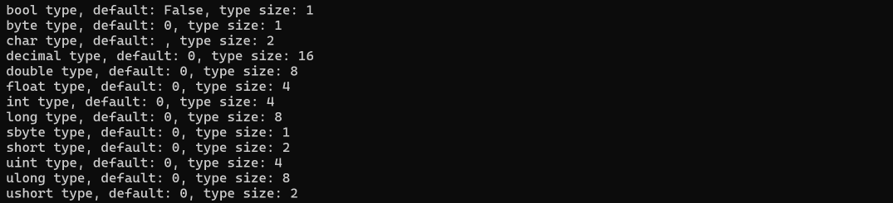
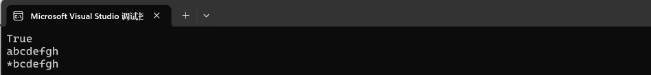
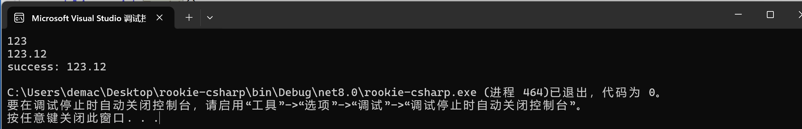
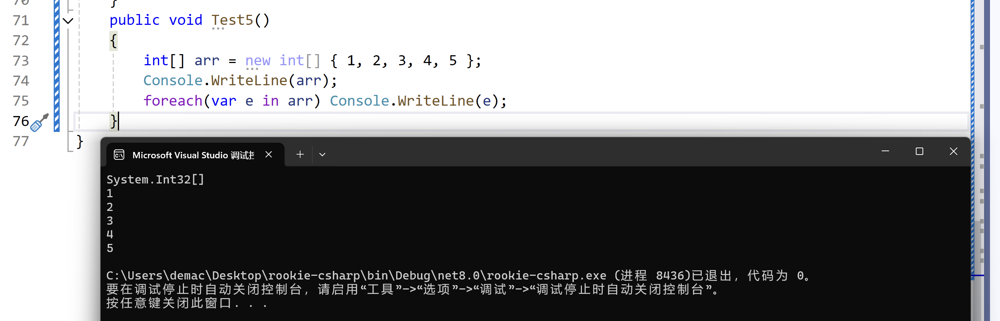
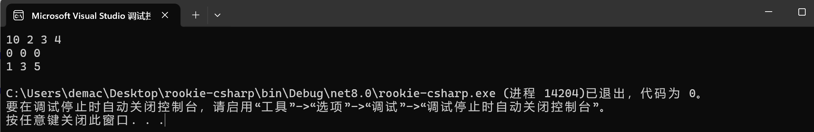
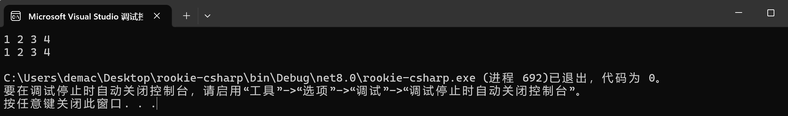

# rookie-csharp

学习入门csharp的记录

**参考: [https://www.runoob.com/csharp/csharp-tutorial.html](https://www.runoob.com/csharp/csharp-tutorial.html)**

> [!TIP]
>
> - C#的构想很接近C++，但是它和JAVA更相似，因为我是写C++比较多，所以这个记录会记录我对C#的，从C++角度的一些理解。
>
> - 如果想通过本文档学习了解C#，需要先熟练编写C++代码，理解面向对象编程思想。
>
> - 本文档提供简单入门，深入了解需要通过项目来学习，通过本文档是不够的。

## 环境

- **[Visual Studio](https://visualstudio.microsoft.com/)**

***

下面代码在文件`Lesson1.cs`中。

## 目录

- [rookie-csharp](#rookie-csharp)
  - [环境](#环境)
  - [目录](#目录)
  - [简单入门](#简单入门)
  - [顶级语句](#顶级语句)
  - [类型](#类型)
    - [值类型](#值类型)
    - [浅拷贝还是深拷贝](#浅拷贝还是深拷贝)
    - [引用类型](#引用类型)
    - [指针类型](#指针类型)
  - [类型转换](#类型转换)
    - [隐式和显式](#隐式和显式)
    - [类型转换方法](#类型转换方法)
    - [类型转换重载](#类型转换重载)
  - [从 `stdin` 读数据](#从-stdin-读数据)
  - [一些其他规则](#一些其他规则)
    - [变量的生命周期](#变量的生命周期)
    - [常量](#常量)
    - [运算符](#运算符)
    - [循环](#循环)
    - [访问限定符和继承](#访问限定符和继承)
    - [方法定义（函数定义）](#方法定义函数定义)
      - [一个递归调用的例子](#一个递归调用的例子)
      - [输入参数、输入输出参数、输出参数](#输入参数输入输出参数输出参数)
    - [可空类型 `Nullable`](#可空类型-nullable)
  - [数组](#数组)
    - [常规数组](#常规数组)
    - [数组作为函数参数](#数组作为函数参数)
    - [参数数组（可变参数）](#参数数组可变参数)
    - [`Array`基类](#array基类)
  - [`String`类型](#string类型)
    - [构造](#构造)
    - [属性](#属性)
    - [常用方法介绍](#常用方法介绍)
  - [`Struct` 封装](#struct-封装)
    - [简单使用](#简单使用)
    - [`struct` vs `class`](#struct-vs-class)
  - [枚举类型](#枚举类型)
  - [类](#类)
    - [基本介绍](#基本介绍)
    - [构造和析构](#构造和析构)
    - [静态成员](#静态成员)
  - [继承和多态](#继承和多态)
  - [运算符重载](#运算符重载)
  - [接口 `Interface`](#接口-interface)
  - [命名空间](#命名空间)
  - [预处理](#预处理)
  - [异常处理](#异常处理)
  - [文件处理](#文件处理)

## 简单入门

首先我用的目录结构:

`src` 里面是每一章节的代码 `Lessonx.cs`。

`Main.cs`:

```cs
// program entry
namespace rookie_csharp
{
    class Run
    {
        static void Main(string[] args)
        {
            Lesson1 t1 = new Lesson1();
            t1.Test1();
        }
    }
}
```

然后在`Src/Lesson1.cs`里定义一些类和接口。

**先来打印一个`hello world`.**

```cs
using System;
using System.Collections.Generic;
using System.Linq;
using System.Text;
using System.Threading.Tasks;
internal class Lesson1
{
    internal void Test1()
    {
        // print an hello world
        Console.WriteLine("hello world");
        Console.ReadKey();
    }
}
```

程序的第一行 `using System;` - `using` 关键字用于在程序中包含 `System` 命名空间。 一个程序一般有多个 `using` 语句, 相当于C++的 `using namespace std;`

后面`Test1`就是一个函数了，和C++一样，如果不是`static`方法，需要创建对象才能调用，如果是`static`方法，可以直接通过类名调用。

```csharp
Console.WriteLine("hello world");
```

就是打印语句，`Console`是System命名空间的，要包含上才能用。

```csharp
Console.ReadKey();
```

是针对于VSStudio的，防止命令行快速闪退。

> [!NOTE]
>
> - C# 是大小写敏感的。
> - 所有的语句和表达式必须以分号（;）结尾。
> - 程序的执行从 Main 方法开始。
> - 与 Java 不同的是，文件名可以不同于类的名称。

**编写一个简单的类**

```cs
internal class Lesson1
{
    internal class Circle
    {
        public int __r;
        public int __x;
        public int __y;
        public Circle() { }
        public Circle(int r, int x, int y)
        {
            this.__r = r;
            __x = x;
            __y = y;
        }
        public double Area() { return 3.14 * __r * __r; }
        public void ShowFields()
        {
            Console.WriteLine("r: {0}", __r);
            Console.WriteLine("x: {0}", __x);
            Console.WriteLine("y: {0}", __y);
        }
    }
    internal void Test1()
    {
        // print an hello world
        Console.WriteLine("hello world");
        Console.ReadKey();
    }
    internal void Test2() {
        Circle cir = new Circle();
        cir.ShowFields();
        Circle cir2 = new Circle(1, 2, 3);
        cir2.ShowFields();
        Console.WriteLine("Area: {0}", cir2.Area());
    }
}
```


只要会一门面向对象语言其实上面的代码都是很好懂的。

> [!TIP]
>
> - 构造函数要带上`public`不然外面访问不到（细节还没学，后面会详细学）
> - 和C++一样，如果显示编写了构造函数，默认构造就不会自动构造，需要提供无参的构造，不然就不能用`new Circle()`来构造。
> - 如果不初始化字段，会调用自己的构造函数。上面的`int`就会默认构造为0。

## 顶级语句

一句话：可以想像写Python一样写。

**特点：**

- **无需类或方法**：顶级语句允许你直接在文件的顶层编写代码，无需定义类或方法。
- **文件作为入口点**：包含顶级语句的文件被视为程序的入口点，类似于 C# 之前的 `Main` 方法。
- **自动 `Main` 方法**：编译器会自动生成一个 `Main` 方法，并将顶级语句作为 `Main` 方法的主体。
- **支持局部函数**：尽管不需要定义类，但顶级语句的文件中仍然可以定义局部函数。
- **更好的可读性**：对于简单的脚本或工具，顶级语句提供了更好的可读性和简洁性。
- **适用于小型项目**：顶级语句非常适合小型项目或脚本，可以快速编写和运行代码。
- **与现有代码兼容**：顶级语句可以与现有的 C# 代码库一起使用，不会影响现有代码。

> [!WARNING]
>
> - **文件限制：**顶级语句只能在一个源文件中使用。如果在一个项目中有多个使用顶级语句的文件，会导致编译错误。
> - **程序入口：**如果使用顶级语句，则该文件会隐式地包含 Main 方法，并且该文件将成为程序的入口点。
> - **作用域限制：**顶级语句中的代码共享一个全局作用域，这意味着可以在顶级语句中定义的变量和方法可以在整个文件中访问。

```cs
Console.WriteLine("top level statement");
int a = 10;
var b = 20;
Console.WriteLine("a: {0}, b:{1}, a+b:{2}", a, b, a + b);
SayHello.Say(); // static方法用类名调用
class SayHello
{
    public static void Say() { Console.WriteLine("hello"); }
}
// program entry
#if false
namespace rookie_csharp
{
    class Run
    {
        static void Main(string[] args)
        {
            Lesson1 t1 = new Lesson1();
            t1.Test2();
        }
    }
}
#endif
```


- `var`跟`auto`一样，推导类型
- `Console.WriteLine("a: {0}, b:{1}, a+b:{2}", a, b, a + b);`就是可变参数，跟`printf`一个道理，012表示第123个参数，看例子就能懂
- 可以像C++一样用条件编译

## 类型

### 值类型

```cs
internal class DataType {
    public bool bool_data;
    public byte byte_data;
    public char char_data;
    public decimal decimal_data;
    public double double_data;
    public float float_data;
    public int int_data;
    public long long_data;
    public sbyte sbyte_data;
    public short short_data;
    public uint uint_data;
    public ulong ulong_data;
    public ushort ushort_data;
}
internal void Test3()
{
    // 数据类型
    DataType dt = new DataType();
    Console.WriteLine("bool type, default: {0}, type size: {1}", dt.bool_data, sizeof(bool));
    Console.WriteLine("byte type, default: {0}, type size: {1}", dt.byte_data, sizeof(byte));
    Console.WriteLine("char type, default: {0}, type size: {1}", dt.char_data, sizeof(char));
    Console.WriteLine("decimal type, default: {0}, type size: {1}", dt.decimal_data, sizeof(decimal));
    Console.WriteLine("double type, default: {0}, type size: {1}", dt.double_data, sizeof(double));
    Console.WriteLine("float type, default: {0}, type size: {1}", dt.float_data, sizeof(float));
    Console.WriteLine("int type, default: {0}, type size: {1}", dt.int_data, sizeof(int));
    Console.WriteLine("long type, default: {0}, type size: {1}", dt.long_data, sizeof(long));
    Console.WriteLine("sbyte type, default: {0}, type size: {1}", dt.sbyte_data, sizeof(sbyte));
    Console.WriteLine("short type, default: {0}, type size: {1}", dt.short_data, sizeof(short));
    Console.WriteLine("uint type, default: {0}, type size: {1}", dt.uint_data, sizeof(uint));
    Console.WriteLine("ulong type, default: {0}, type size: {1}", dt.ulong_data, sizeof(ulong));
    Console.WriteLine("ushort type, default: {0}, type size: {1}", dt.ushort_data, sizeof(ushort));
}
```

通过程序运行结果就可以得出每一种变量的默认值和变量的空间占的大小。



**变量的范围: [https://www.runoob.com/csharp/csharp-data-types.html](https://www.runoob.com/csharp/csharp-data-types.html)**

### 浅拷贝还是深拷贝


类是浅拷贝。

为了深拷贝，首先需要提供拷贝构造，和cpp一样

```cs
public Circle(Circle c) {
    __r = c.__r;
    __x = c.__x;
    __y = c.__y;
}
```

然后需要显示调用拷贝构造才能构造新对象。


> [!CAUTION]
>
> `Circle c2 = c1;` // 就算有拷贝构造，这个也是浅拷贝，不同于C++

### 引用类型

引用类型不包含存储在变量中的实际数据，但它们包含对变量的引用。

换句话说，它们指的是一个内存位置。使用多个变量时，引用类型可以指向一个内存位置。如果内存位置的数据是由一个变量改变的，其他变量会自动反映这种值的变化。内置的引用类型有：`object`、`dynamic` 和 `string`。

**对象（Object）类型**

对象（Object）类型 是 C# 通用类型系统（Common Type System - CTS）中所有数据类型的终极基类。Object 是 System.Object 类的别名。所以对象（Object）类型可以被分配任何其他类型（值类型、引用类型、预定义类型或用户自定义类型）的值。但是，在分配值之前，需要先进行类型转换。

当一个值类型转换为对象类型时，则被称为 **装箱**；另一方面，当一个对象类型转换为值类型时，则被称为 **拆箱**。

**动态（Dynamic）类型**

您可以存储任何类型的值在动态数据类型变量中。这些变量的类型检查是在运行时发生的。

声明动态类型的语法：

```
dynamic <variable_name> = value;
```

例如：

```
dynamic d = 20;
```

动态类型与对象类型相似，但是对象类型变量的类型检查是在编译时发生的，而动态类型变量的类型检查是在运行时发生的。

**字符串（String）类型**

字符串（String）类型 允许您给变量分配任何字符串值。字符串（String）类型是 System.String 类的别名。它是从对象（Object）类型派生的。字符串（String）类型的值可以通过两种形式进行分配：引号和 @引号。

C# string 字符串的前面可以加 @（称作"逐字字符串"）将转义字符（\）当作普通字符对待。

用户自定义引用类型有：class、interface 或 delegate。

**参考: [https://www.runoob.com/csharp/csharp-data-types.html](https://www.runoob.com/csharp/csharp-data-types.html)**

```cs
internal void Test5()
{
    String str = "abcdefg";
    String str2 = str;
    // Console.WriteLine("str addr: {0}, {1}", &str, &str2); // error
    /**
     C#是高级的安全语言，不能访问地址，如果要判断是不是同一个引用，可以用 Object.ReferenceEquals
     */
    Console.WriteLine(Object.ReferenceEquals(str, str2));
    //str2[0] = 'a'; // only read
    StringBuilder mutable_str = new StringBuilder("abcdefgh");
    StringBuilder mutable_str2 = new StringBuilder(mutable_str.ToString()); // deepcopy
    // StringBuilder mutable_str2 = mutable_str; // reference
    mutable_str2[0] = '*';
    Console.WriteLine(mutable_str.ToString());
    Console.WriteLine(mutable_str2.ToString());
}
```



- `String`是只读的
- `String str2 = str;`是浅拷贝
- `Console.WriteLine("str addr: {0}, {1}", &str, &str2); // error`是非法操作， C#是高级的安全语言，不能访问地址，如果要判断是不是同一个引用，可以用 `Object.ReferenceEquals`
- `Console.WriteLine(Object.ReferenceEquals(str, str2));`可以判断两个变量是不是指向同一个对象
- `StringBuilder`是可变字符串对象
- `StringBuilder mutable_str2 = new StringBuilder(mutable_str.ToString()); // deepcopy` 是深拷贝
- `StringBuilder mutable_str2 = mutable_str; // reference` 是引用

### 指针类型

后续说明

***

下面代码在`Lesson2.cs`中。

## 类型转换

### 隐式和显式

C#中有两种类型转换：隐式和显式，和CPP一样的，很好理解。

```cs
byte b = 10;
int i = b; // 隐式转换
```

显示就是强转，强转可能会导致丢失数据，这个也很好理解，不赘述。

```cs
int intValue = 42;
float floatValue = (float)intValue; // 强制从 int 到 float，数据可能损失精度
```

### 类型转换方法

| 序号 | 内置方法                                                     |
| ---- | ------------------------------------------------------------ |
| 1    | `ToBoolean` 如果可能的话，把类型转换为布尔型。               |
| 2    | `ToByte` 把类型转换为字节类型。                              |
| 3    | `ToChar` 如果可能的话，把类型转换为单个 Unicode 字符类型。   |
| 4    | `ToDateTime` 把类型（整数或字符串类型）转换为 日期-时间 结构。 |
| 5    | `ToDecimal` 把浮点型或整数类型转换为十进制类型。             |
| 6    | `ToDouble` 把类型转换为双精度浮点型。                        |
| 7    | `ToInt16` 把类型转换为 16 位整数类型。                       |
| 8    | `ToInt32` 把类型转换为 32 位整数类型。                       |
| 9    | `ToInt64` 把类型转换为 64 位整数类型。                       |
| 10   | `ToSbyte` 把类型转换为有符号字节类型。                       |
| 11   | `ToSingle` 把类型转换为小浮点数类型。                        |
| 12   | `ToString`把类型转换为字符串类型。                           |
| 13   | `ToType` 把类型转换为指定类型。                              |
| 14   | `ToUInt16` 把类型转换为 16 位无符号整数类型。                |
| 15   | `ToUInt32` 把类型转换为 32 位无符号整数类型。                |
| 16   | `ToUInt64` 把类型转换为 64 位无符号整数类型。                |

这些方法都定义在 `System.Convert` 类中，使用时需要包含 System 命名空间。它们提供了一种安全的方式来执行类型转换，因为它们可以处理 null值，**并且会抛出异常**，如果转换不可能进行。

**参考：[https://www.runoob.com/csharp/csharp-type-conversion.html](https://www.runoob.com/csharp/csharp-type-conversion.html)**

上面这些都是 `Convert` 类里面的非静态方法。

当然，`System.Convert` 也提供了一些静态的方法可以用。

```cs
public void Test1()
{
    // 使用 Convert 的静态方法
    string str = "123";
    int num = Convert.ToInt32(str);
    Console.WriteLine(num);
    // 使用 Parse 方法
    string str2 = "123.12";
    double d = double.Parse(str2);
    Console.WriteLine(d);
    // 使用 TryParse 方法
    string str3 = "123.12";
    double d2;
    bool if_success = double.TryParse(str3, out d2);
    if(if_success)
    {
        Console.WriteLine("success: {0}", d2);
    } else
    {
        Console.WriteLine("failed: {0}", d2);
    }
}
```



- `Parse` 方法用于将字符串转换为对应的数值类型，如果转换失败会抛出异常。
- `TryParse` 方法类似于 `Parse`，但它不会抛出异常，而是返回一个布尔值指示转换是否成功。

### 类型转换重载

C# 还允许你定义自定义类型转换操作，通过在类型中定义 `implicit` 或 `explicit` 关键字。

```cs
internal class MyNumber
{
    public int Value;
    public MyNumber(int value)
    {
        Value = value;
    }
    public static implicit operator int(MyNumber mn)
    {
        return mn.Value;
    }
    public static explicit operator MyNumber(int n)
    {
        return new MyNumber(n);
    }
}
// ...
public void Test2()
{
    MyNumber mn = new MyNumber(1);
    int n = mn;
    MyNumber nm2 = (MyNumber)(n + 1);
    Console.WriteLine(nm2); // result: 2
}
```

相当于重载，很好理解。

- 为什么用 `static`，因为和 `this` 无关。

**详细的类型转换表格总结：[https://www.runoob.com/csharp/csharp-type-conversion.html](https://www.runoob.com/csharp/csharp-type-conversion.html)**

## 从 `stdin` 读数据

`System` 命名空间中的 `Console` 类提供了一个函数 `ReadLine()`，用于接收来自用户的输入，并把它存储到一个变量中。

```cs
public void Test3()
{
    int n = 0;
    n = Convert.ToInt32(Console.ReadLine());
    Console.WriteLine(n);
}
```

## 一些其他规则

### 变量的生命周期

简单变量的生命周期和CPP一样，不赘述。

### 常量

整数常量可以是十进制、八进制或十六进制的常量。前缀指定基数：0x 或 0X 表示十六进制，0 表示八进制，没有前缀则表示十进制。

整数常量也可以有后缀，可以是 U 和 L 的组合，其中，U 和 L 分别表示 unsigned 和 long。后缀可以是大写或者小写，多个后缀以任意顺序进行组合。

这里有一些整数常量的实例：

```cs
212         /* 合法 */
215u        /* 合法 */
0xFeeL      /* 合法 */
078         /* 非法：8 不是一个八进制数字 */
032UU       /* 非法：不能重复后缀 */
```

以下是各种类型的整数常量的实例：

```cs
85         /* 十进制 */
0213       /* 八进制 */
0x4b       /* 十六进制 */
30         /* int */
30u        /* 无符号 int */
30l        /* long */
30ul       /* 无符号 long */
```

**参考：[https://www.runoob.com/csharp/csharp-constants.html](https://www.runoob.com/csharp/csharp-constants.html)**

一个浮点常量是由整数部分、小数点、小数部分和指数部分组成。您可以使用小数形式或者指数形式来表示浮点常量。这里有一些浮点常量的实例：

```cs
3.14159       /* 合法 */
314159E-5L    /* 合法 */
510E          /* 非法：不完全指数 */
210f          /* 非法：没有小数或指数 */
.e55          /* 非法：缺少整数或小数 */
```

字符常量里面转义字符那些，和其他语言基本相同。

字符串常量：字符串常量是括在双引号 `""` 里，或者是括在 `@""` 里。字符串常量包含的字符与字符常量相似。

定义常量：

```cs
internal class TestConst {
    public const int v1 = 1;
    public int v2 = 2;
}
public void Test4()
{
    TestConst tc = new TestConst();
    Console.WriteLine("const int v1: {0}", TestConst.v1);
    Console.WriteLine("int v2 = {0}", tc.v2);
}
```

> [!NOTE]
>
> **注意：类内常字段用类名访问，而不是用实例化后对象进行访问。**

### 运算符

运算符是一种告诉编译器执行特定的数学或逻辑操作的符号。C# 有丰富的内置运算符，分类如下：

- 算术运算符
- 关系运算符
- 逻辑运算符
- 位运算符
- 赋值运算符
- 其他运算符

**参考：[https://www.runoob.com/csharp/csharp-operators.html](https://www.runoob.com/csharp/csharp-operators.html)**

前面五种运算符和CPP相同，不赘述。

| 运算符     | 描述                                   | 实例                                                         |
| :--------- | :------------------------------------- | :----------------------------------------------------------- |
| `sizeof()` | 返回数据类型的大小                     | `sizeof(int)`，将返回 4.                                     |
| `typeof()` | 返回 class 的类型                      | `typeof(StreamReader);`                                      |
| `&`        | 返回变量的地址                         | `&a;` 将得到变量的实际地址。                                 |
| `*`        | 变量的指针                             | `*a;` 将指向一个变量。                                       |
| `? :`      | 条件表达式                             | 如果条件为真 ? 则为 X : 否则为 Y，和CPP的一样，三目          |
| `is`       | 判断对象是否为某一类型。               | `If( Ford is Car)`  检查 Ford 是否是 Car 类的一个对象。      |
| `as`       | 强制转换，即使转换失败也不会抛出异常。 | `Object obj = new StringReader("Hello"); StringReader r = obj as StringReader;` |

### 循环

`while`, `for`, `do while` 和CPP一样。

`foreach`循环：类似CPP的`for(auto e : v)`语句。

```cs
public void Test5()
{
    int[] arr = new int[] { 1, 2, 3, 4, 5 };
    Console.WriteLine(arr);
    foreach(var e in arr) Console.WriteLine(e);
}
```



### 访问限定符和继承

- `public`：所有对象都可以访问；
- `private`：对象本身在对象内部可以访问；
- `protected`：只有该类对象及其子类对象可以访问
- `internal`：同一个程序集的对象可以访问；
- `protected internal`：访问限于当前程序集或派生自包含类的类型。

不写默认是`private`

`protected`相关的用于继承，和CPP一样，不赘述。

### 方法定义（函数定义）

前面已经编写很多函数定义了，不赘述，这里介绍前面没有提到的一些规则。

#### 一个递归调用的例子

用递归求一个阶乘吧

```cs
public int Factorial(int input)
{
    if (input == 0) return 0;
    if (input == 1) return 1;
    return input * Factorial(input - 1);
}
public void Test6()
{
    int input = 6;
    Console.WriteLine(Factorial(input)); // result: 720
}
```

#### 输入参数、输入输出参数、输出参数

这个很好理解，一个优秀的C++工程师在设计三种参数的时候都有讲究，比如：

```cpp
void func(const std::string& input, std::string& input_output, std::string* output);
```

**第一个是输入参数，必须带上`const`，这是优秀的编码习惯，第二个是输入输出参数，第三种是输出参数，一般用指针来写，这种规范是一定要在编码中体现出来的。**

**对应C#：**

```cs
public void Func(int a, ref int b, out int c) {}
```

`ref`表示传引用，`out`表示纯输出参数。

> [!NOTE]
>
> 在 C++ 和 C# 中，参数传递的机制和关键字使用存在一些显著的差异，特别是关于引用和 `const` 的使用。这些差异主要源于两种语言在设计哲学和运行时行为上的不同。
>
> **C++ 中的 `const` 和引用**
>
> 在 C++ 中，`const` 关键字和引用 (`&`) 被广泛用于参数传递，主要原因是：
> - **性能优化**：通过传递引用来避免复制大型对象，例如 `std::string`，同时使用 `const` 保证函数不会修改传入的对象。
> - **确保不可变性**：`const` 关键字确保函数内部不能修改输入参数，增加代码的安全性和可预测性。
>
> **C# 中的参数传递**
>
> C# 设计时采用了不同的方法：
> - **引用语义**：C# 中的类类型（引用类型）默认就是通过引用传递的，但这是引用的副本，而非对象本身的直接引用。这意味着你可以修改对象的内部状态，但不能修改对象本身的引用。
> - **值类型的传递方式**：值类型（如 `int`, `struct` 等）默认是通过值传递的，即创建原始数据的副本。如果你需要通过函数修改原始值类型数据，可以使用 `ref` 或 `out`。
> - **不支持 `const`**：C# 没有直接等价于 C++ 中的 `const` 修饰符。C# 不能声明一个方法的参数为 `const`，意味着不像在 C++ 中那样在编译时强制禁止修改参数。如果需要保证不修改数据，只能依靠开发者的约定或通过使用不可变对象来实现。
>
> **设计哲学差异**
>
> - **简化语言复杂度**：C# 设计时尽可能简化语言特性，避免了 C++ 中的一些复杂性，如指针算术和复杂的引用传递规则。
> - **安全性**：C# 强调内存和执行安全，自动内存管理（垃圾收集）减少了直接内存操作的需要，也就减少了 `const` 和指针的必要性。
>
> 总结来说，虽然 C# 在设计上不支持像 C++ 那样的 `const` 修饰符或相同的引用传递语义，但它提供了其它机制（如 `readonly` 修饰符、不可变集合等）来实现类似的目标。C# 的设计选择更强调简洁性和安全性，虽然这导致了一些灵活性的牺牲。

```cs
public void Func(int a, ref int b, out int c) {
    int aa = a;
    int bb = b;
    c = b;
}
public void Test7()
{
    int a = 10, b = 10, c;
    Func(a, ref b, out c);
}
```

### 可空类型 `Nullable`

简单说明：`?` 单问号用于对 `int、double、bool` 等无法直接赋值为 `null` 的数据类型进行 `null` 的赋值，意思是这个数据类型是 `Nullable` 类型的。

```cs
int i; // default: 0
int? i; // default: null
```

`??` 双问号用于判断一个变量在为 `null` 的时候返回一个指定的值。

> [!TIP]
>
> `int? i = 3;` 等同于 `Nullable<int> i = new Nullable<int>(3);`

**`?`的用法：**

```cs
public void Test8()
{
    int? a = null;
    int? b = 10;
    int? c = new int();
    int? d = new int?();
    Console.WriteLine("{0}, {1}, {2}, {3}", a, b, c, d); // result: , 10, 0,
}
```

**`??`的用法：**

简单来说就是，如果为`null`则返回预设值，否则返回原有的非`null`值。

```cs
public void Test9()
{
    int? a = null;
    int res1 = a ?? -1;
    a = 10;
    int res2 = a ?? -1;
    Console.WriteLine("{0}, {1}", res1, res2); // -1, 10
}
```

## 数组

### 常规数组

数组下标从0开始，其他规则基本和C++相同，直接看例子。

```cs
public void Test1()
{
    int[] arr1 = { 1, 2, 3, 4 };
    int[] arr2 = new int[3];
    int[] arr3 = new int[3] { 1, 3, 5 };
    arr1[0] = 10;
    foreach (int i in arr1) Console.Write(i + " ");
    Console.WriteLine();
    foreach (int i in arr2) Console.Write(i + " ");
    Console.WriteLine();
    foreach (int i in arr3) Console.Write(i + " ");
    Console.WriteLine();
}
```



**多维数组：**

```cs
public void Test2()
{
    string[,] arr = { { "aaa", "bbb" }, { "ccc", "ddd" } };
    foreach (var subarr in arr) foreach (var i in subarr) Console.Write(i + " ");
    Console.WriteLine();
    /** 可以发现第一层 foreach之后已经可以拿到所有的数据了，不用第二层循环 */
    foreach (var i in arr)  Console.Write(i + " ");
    Console.WriteLine();
    /** 分层打印 */
    for (int i = 0; i < arr.GetLength(0); ++i) 
    {
        for(int j = 0; j < arr.GetLength(1); ++j)
        {
            Console.Write(arr[i, j] + " ");
        }
        Console.WriteLine();
    }
    Console.WriteLine();
}
```

**交错数组：**

本质：数组的数组

可以声明：

```cs
int [][] scores;
```

声明不会创建空间，需要手动`new`。

```cs
int[][] scores = new int[5][];
for (int i = 0; i < scores.Length; i++) 
{
   scores[i] = new int[4];
}
```

另一种初始化的方式：

```cs
int[][] scores = new int[2][]{new int[]{92,93,94},new int[]{85,66,87,88}};
```

参考：**[https://www.runoob.com/csharp/csharp-jagged-arrays.html](https://www.runoob.com/csharp/csharp-jagged-arrays.html)**

```cs
public void Test3()
{
    int[][] arr = { new int[] { 1, 2, 3 }, new int[] { 2, 3} };
    foreach (var subarr in arr)
    {
        foreach (int i in subarr) Console.Write(i + " ");
        Console.WriteLine();
    }
}
```

交错数组需要两层`foreach`来访问。

### 数组作为函数参数

和C++/C相同，数组名为首元素地址（说法不准确，但可以这样理解）

直接看例子就行了

```cs
public void PrintArray(int[] arr)
{
    foreach (var i in arr) Console.Write(i + " ");
    Console.WriteLine();
    for (int i = 0; i < arr.Length; i++) Console.Write(arr[i] + " ");
    Console.WriteLine();
}
public void Test4()
{
    int[] arr = { 1, 2, 3, 4 };
    PrintArray(arr);
}
```



所以是不需要传递数组的大小的。

### 参数数组（可变参数）

在使用数组作为形参时，C# 提供了 `params` 关键字，使调用数组为形参的方法时，既可以传递数组实参，也可以传递一组数组元素。

例子：

```cs
public void ShowAllParam(params int[] arr)
{
    foreach (var i in arr) Console.Write(i + " ");
    Console.WriteLine();
}
public void Test5()
{
    ShowAllParam(1, 2, 3, 4, 5); // result: 1, 2, 3, 4, 5
}
```

```cs
public void ShowAllParam(params int[] arr, params string[] strarr){} // err
```

> [!NOTE]
>
> `params`参数必须是最后一个参数。

```cs
public void ShowAllParam(string str, params int[] arr)
{
    Console.WriteLine(str);
    foreach (var i in arr) Console.Write(i + " ");
    Console.WriteLine();
}
public void Test5()
{
    ShowAllParam("hello world", 1, 2, 3, 4, 5);
}
```

这种操作是合法的。

### `Array`基类

`Array` 类是 C# 中所有数组的基类，它是在 `System` 命名空间中定义。`Array`类提供了各种用于数组的属性和方法。

**下表列出了 Array 类中一些最常用的属性：**

| 序号 | 属性 & 描述                                                  |
| :--- | :----------------------------------------------------------- |
| 1    | `IsFixedSize` 获取一个值，该值指示数组是否带有固定大小。     |
| 2    | `IsReadOnly` 获取一个值，该值指示数组是否只读。              |
| 3    | `Length` 获取一个 32 位整数，该值表示所有维度的数组中的元素总数。 |
| 4    | `LongLength` 获取一个 64 位整数，该值表示所有维度的数组中的元素总数。 |
| 5    | `Rank` 获取数组的秩（维度）。                                |

如需了解 Array 类的完整的属性列表，请参阅微软的 C# 文档。

**下表列出了 Array 类中一些最常用的方法：**

| 序号 | 方法 & 描述                                                  |
| :--- | :----------------------------------------------------------- |
| 1    | `Clear` 根据元素的类型，设置数组中某个范围的元素为零、为 false 或者为 null。 |
| 2    | `Copy(Array, Array, Int32)` 从数组的第一个元素开始复制某个范围的元素到另一个数组的第一个元素位置。长度由一个 32 位整数指定。 |
| 3    | `CopyTo(Array, Int32)` 从当前的一维数组中复制所有的元素到一个指定的一维数组的指定索引位置。索引由一个 32 位整数指定。 |
| 4    | `GetLength`  获取一个 32 位整数，该值表示指定维度的数组中的元素总数。 |
| 5    | `GetLongLength` 获取一个 64 位整数，该值表示指定维度的数组中的元素总数。 |
| 6    | `GetLowerBound` 获取数组中指定维度的下界。                   |
| 7    | `GetType` 获取当前实例的类型。从对象（Object）继承。         |
| 8    | `GetUpperBound` 获取数组中指定维度的上界。                   |
| 9    | `GetValue(Int32)` 获取一维数组中指定位置的值。索引由一个 32 位整数指定。 |
| 10   | `IndexOf(Array, Object)` 搜索指定的对象，返回整个一维数组中第一次出现的索引。 |
| 11   | `Reverse(Array)` 逆转整个一维数组中元素的顺序。              |
| 12   | `SetValue(Object, Int32)` 给一维数组中指定位置的元素设置值。索引由一个 32 位整数指定。 |
| 13   | `Sort(Array)` 使用数组的每个元素的 IComparable 实现来排序整个一维数组中的元素。 |
| 14   | `ToString` 返回一个表示当前对象的字符串。从对象（Object）继承。 |

如需了解 Array 类的完整的方法列表，请参阅微软的 C# 文档。

**文字来自：[https://www.runoob.com/csharp/csharp-array-class.html](https://www.runoob.com/csharp/csharp-array-class.html)**


这里用了一个 lambda 表达式。

在 C# 中，如果想对数组进行排序并使用自定义的比较方法，可以使用 `Array.Sort<T>` 方法的几种重载之一，这些重载方法允许你指定比较器。可以通过实现 `IComparer<T>` 接口或使用 `Comparison<T>` 委托来定义自定义比较逻辑。

写一个 `MyCompare` 函数。


上面这个是实现一个Compare函数，其实本质和lambda表达式的是一样的。当然这里我用`if, else`, 其实C#给我们内置好了，用`CompareTo`方法就行，和上面是等价的。

> [!NOTE]
>
> 注意：实现的 `MyCompare` 函数是需要 `int` 返回值的。
>
> 这里要注意，思想和C++是一样的。
>
> `Array.Sort()`都是设置从“小”到“大”排列，这个大/小如何定义是可以设置的
>
> 如果`MyCompare(x, y)`返回的是负整数，表示 `x < y`;
>
> 如果`MyCompare(x, y)`返回的是0，表示 `x = y`;
>
> 如果`MyCompare(x, y)`返回的是正整数，表示 `x > y`;

需要创建一个实现 `IComparer<int>` 接口的类，然后在该类中实现 `Compare`类。


> [!CAUTION]
>
> 类里的函数名必须为`Compare(T x, T y)`。
>
> 这是因为 `IComparer<T>` 接口规定了一个具体的方法签名，必须遵循这个签名来实现比较逻辑。

**另外需要注意：这里要和C++区分开来，C++也可以用类或者函数来当仿函数**

- 用类在C++里是需要带括号的，然后类内重载对比操作符 `operator<` 或 `operator==`等。
- 用函数在C++里不用带括号，函数参数和C#一样，有要求，函数返回值是 `bool` 类型。

## `String`类型

### 构造

在 C# 中，您可以使用字符数组来表示字符串，但是，更常见的做法是使用 `string` 关键字来声明一个字符串变量。`string` 关键字是 `System.String` 类的别名。

可以使用以下方法之一来创建 `string` 对象：

- 通过给 `string` 变量指定一个字符串
- 通过使用 `string` 类构造函数
- 通过使用字符串串联运算符（ + ）
- 通过检索属性或调用一个返回字符串的方法
- 通过格式化方法来转换一个值或对象为它的字符串表示形式

```cs
public void Test8()
{
    // 直接指定字符串
    string str1 = "abcd";
    Console.WriteLine(str1);
    // 使用 + 运算符
    string str2 = "abcd" + "efg";
    Console.WriteLine(str2);
    // 方法返回字符串
    string[] str_array = { "Hello ", "world" };
    string mesg = String.Join("", str_array);
    Console.WriteLine(mesg);
    // 用于转化值的格式化方法
    DateTime waiting = new DateTime(2012, 10, 10, 17, 58, 1);
    string str3 = String.Format("the time: {0:t} on {0:D}", waiting);
    Console.WriteLine(str3);
}
```

输出：

```sh
abcd
abcdefg
Hello world
the time: 17:58 on 2012年10月10日
```

### 属性

| 序号 | 属性名称 & 描述                                            |
| :--- | :--------------------------------------------------------- |
| 1    | `Chars` 在当前 `String` 对象中获取 `Char` 对象的指定位置。 |
| 2    | `Length` 在当前的 `String` 对象中获取字符数。              |

### 常用方法介绍

**此部分参考: [https://www.runoob.com/csharp/csharp-string.html](https://www.runoob.com/csharp/csharp-string.html)**

```cs
public static int Compare( string strA, string strB )
public static int Compare( string strA, string strB, bool ignoreCase)
```

比较两个指定的 `string` 对象，并返回一个表示它们在排列顺序中相对位置的整数。该方法区分大小写。

如果布尔参数为真时，该方法不区分大小写。

```cs
public static string Concat( string str0, string str1, string str2, string str3, ...)
```

连接若干个字符串。

```cs
public bool Contains(string value)
```

返回一个表示指定 `string` 对象是否出现在字符串中的值。

```cs
public static string Copy(string str)
```

创建一个与指定字符串具有相同值的新的 `String` 对象

```cs
public void CopyTo(int sourceIndex, char[] destination, int destinationIndex, int count)
```

从 string 对象的指定位置开始复制指定数量的字符到 Unicode 字符数组中的指定位置。

```cs
public bool EndsWith( string value )
public bool StartsWith( string value )
```

判断 `string` 对象的结尾/开头是否匹配指定的字符串。

```cs
public bool Equals( string value )
public static bool Equals( string a, string b )
```

判断两个字符串是否相同。

```cs
public static string Format( string format, Object arg0 )
```

把指定字符串中一个或多个格式项替换为指定对象的字符串表示形式。

```cs
public int IndexOf( char value )
public int IndexOf( string value )
public int IndexOf( string value, int startIndex )
```

返回指定字符/字符串第一次出现的索引，索引从 0 开始，也可以指定。

```cs
public int IndexOfAny( char[] anyOf )
public int IndexOfAny( char[] anyOf, int startIndex )
```

返回char数组中任意字符/字符串第一次出现的索引，索引从 0 开始，也可以指定。

```cs
public string Insert( int startIndex, string value )
```

返回一个新的字符串，其中，指定的字符串被插入在当前 `string` 对象的指定索引位置。

```cs
public static bool IsNullOrEmpty( string value )
```

指示指定的字符串是否为 null 或者是否为一个空的字符串。

```cs
public static string Join( string separator, string[] value )
public static string Join( string separator, string[] value, int startIndex, int count )
```

1. 连接一个字符串数组中的所有元素，使用指定的分隔符分隔每个元素。
2. 连接一个字符串数组中的指定位置开始的指定元素，使用指定的分隔符分隔每个元素。

```cs
public int LastIndexOf( char value )
public int LastIndexOf( string value )
```

返回指定字符串在当前 string 对象中最后一次出现的索引位置，索引从 0 开始。

```cs
public string Remove( int startIndex )
public string Remove( int startIndex, int count )
```

移除当前实例中的所有字符，从指定位置开始，一直到最后一个位置为止或指定数量。

```cs
public string Replace( char oldChar, char newChar )
public string Replace( string oldValue, string newValue )
```

替换字符/字符串。

```cs
public string[] Split( params char[] separator )
public string[] Split( char[] separator, int count )
```

返回一个字符串数组，包含当前的 string 对象中的子字符串，子字符串是使用指定的 Unicode 字符数组中的元素进行分隔的。`int` 参数指定要返回的子字符串的最大数目。

```cs
public char[] ToCharArray()
public char[] ToCharArray( int startIndex, int length )
```

字符串转字符数组。

```cs
public string ToLower()
public string ToUpper()
```

大小写转换。

```cs
public string Trim()
```

移除当前 String 对象中的所有前导空白字符和后置空白字符。

**示例代码如下所示：**

```cs
public void Test9()
{
    // Compare
    string str1 = "abc";
    string str2 = "bb";
    Console.WriteLine(String.Compare(str1, str2)); // -1
    // Concat
    string str3 = "ccdd";
    Console.WriteLine(String.Concat(str1, str2, str3, str1, str2)); // abcbbccddabcbb
    // Contains
    str1 = "abcdefg";
    string sub_str1 = "bcd";
    string sub_str2 = "bb";
    Console.WriteLine(str1.Contains(sub_str1)); // True
    Console.WriteLine(str1.Contains(sub_str2)); // False
    // Copy
    string str4 = String.Copy(str1);
    Console.WriteLine(str4); // abcdefg
    // CopyTo
    char[] dest = new char[10];
    str4.CopyTo(1, dest, 0, 3); // copy "bcd" to dest
    Console.WriteLine(dest); // bcd\0\0\0... -> bcd
    // EndsWith
    string end = "efg";
    Console.WriteLine(str4.EndsWith(end)); // True
    // Equals / static Equals
    string str5 = "abc";
    string str6 = "abc";
    string str7 = "aBc";
    Console.WriteLine(str5.Equals(str6)); // True
    Console.WriteLine(str5.Equals(str7)); // False
    Console.WriteLine(String.Equals(str5, str6)); // True
}
public void Test10()
{
    // Format
    string temp = "abc{0}{1}";
    string str1 = String.Format(temp, 1, 2);
    Console.WriteLine(str1); // abc12
    // IndexOf
    char ch = 'a';
    string str2 = "baba";
    Console.WriteLine(str2.IndexOf(ch)); // 1
    // IndexOf
    string sub1 = "ab";
    string sub2 = "abc";
    Console.WriteLine(str2.IndexOf(sub1)); // 1
    Console.WriteLine(str2.IndexOf(sub2)); // -1
    // IndexOfAny
    string str3 = "aaabbbcccddd";
    char[] ch_arr = { 'd', 'e', 'c' };
    Console.WriteLine(str3.IndexOfAny(ch_arr)); // 6
    // Insert
    temp = "eee";
    Console.WriteLine(str3.Insert(0, temp)); // eeeaaabbbcccddd
    // IsNullOrEmpty
    string str4 = new String("");
    string str5 = null;
    Console.WriteLine(String.IsNullOrEmpty(str4)); // True
    Console.WriteLine(String.IsNullOrEmpty(str5)); // True
    // Join
    string[] str_arr = { "aaa", "bbb", "ccc" };
    Console.WriteLine(String.Join("-", str_arr)); // aaa-bbb-ccc
}
public void PrintArray<type>(type[] arr)
{
    foreach (type i in arr) Console.Write(i + " ");
    Console.WriteLine();
}
public void Test11()
{
    // LastIndexOf
    string str1 = "abcdefea";
    Console.WriteLine(str1.LastIndexOf('a')); // 7
    // Remove
    string str2 = "abc****c";
    Console.WriteLine(str2.Remove(2)); // ab
    Console.WriteLine(str2.Remove(2, str2.Length - 1 - 2)); // abc
    // Replace
    string str3 = "aabaabcsda";
    Console.WriteLine(str3.Replace('a', 'A')); // AAbAAbcsdA
    Console.WriteLine(str3.Replace("ab", "AB")); // aABaABcsda
    // Split
    string str4 = "a*b*c^dd*cd^aa";
    PrintArray(str4.Split('*', '^')); // a b c dd cd aa
    // ToCharArray
    string str5 = "abcd";
    PrintArray(str5.ToCharArray()); // a b c d
    // Trim
    string str6 = "    aasdfa   ";
    Console.WriteLine(str6.Trim()); // aasdfa
}
```

## `Struct` 封装

### 简单使用

直接先放一个使用的例子，和C++的简单使用是相同的。

```cs
internal struct MyDate
{
    public int year;
    public int month;
    public int day;
    public MyDate(int y, int m, int d) { year = y; month = m; day = d; }
    public void ShowDate() { Console.WriteLine($"{year}:{month}:{day}"); }
}
public void Test1()
{
    MyDate d1 = new MyDate(12, 2, 3);
    d1.ShowDate();	// 12:2:3
}
```

### `struct` vs `class`

**参考：[https://www.runoob.com/csharp/csharp-struct.html](https://www.runoob.com/csharp/csharp-struct.html)**

**`struct`的一些特点：**

- 结构可以定义构造函数，但不能定义析构函数。不能给结构定义无参构造函数，无参构造函数是默认自动定义的。
- 结构里可以实现一个或者多个接口
- 结构成员不能被指定为 `abstract`, `virtual`, `protected`
- 当使用 `New` 操作符创建一个结构对象时，会调用适当的构造函数来创建结构。与类不同，结构可以不使用 New 操作符即可被实例化。但是如果不使用 `New` 操作符，只有在所有的字段都被初始化之后，字段才被赋值，对象才被使用。

**`struct` vs `class` :**

- 结构是值类型，在栈上。结构赋值给另一个变量的时候，是深拷贝。类是引用类型，在堆上。类赋值的时候如果不调用拷贝构造，则是浅拷贝。
- 结构不支持继承和多态，但类可以。
- 结构不能有无参数的构造函数： 结构不能包含无参数的构造函数。每个结构都必须有至少一个有参数的构造函数。类可以有无参数的构造函数： 类可以包含无参数的构造函数，如果没有提供构造函数，系统会提供默认的无参数构造函数。
- 结构体是值类型，不能直接设置为 `null`：因为 `null` 是引用类型的默认值，而不是值类型的默认值。如果需要表示结构体变量的缺失或无效状态，可以使用 `Nullable<T>` 或称为 `T?` 的可空类型。

## 枚举类型

枚举列表中的每个符号代表一个整数值，一个比它前面的符号大的整数值。默认情况下，第一个枚举符号的值是 0

例如：

```cs
enum Days { Sun, Mon, tue, Wed, thu, Fri, Sat };
```

## 类

### 基本介绍

前面已经使用到很多类了，这里不赘述上面有的知识点。

> [!TIP]
>
> 类的默认访问标识符是 `internal`，成员的默认访问标识符是 `private`。

### 构造和析构

和C++基本相同，不赘述。

### 静态成员

无论实例化多少个类，静态成员只有一个副本。

```cs
class MyClass
{
    public const int a = 10;
    public static int b = 20;
}
public void Test2()
{
    Console.WriteLine(MyClass.a); // 10
    Console.WriteLine(MyClass.b++); // 20
    Console.WriteLine(MyClass.b); // 21
}
```

和 `const` 字段一样用类名访问。

## 继承和多态

和C++基本一致，不赘述概念和规则了。

这里放一个函数重写的例子吧。

```cs
public class BaseShape { public virtual void Print() { Console.WriteLine("Base Shape"); } }
public class Circle : BaseShape { public override void Print() { Console.WriteLine("Circle"); } }
public class Rect : BaseShape { public override void Print() { Console.WriteLine("Rect"); } }
public void PrintShapeType(BaseShape bs) { bs.Print(); }
public void Test3()
{
    BaseShape bs = new BaseShape();
    Circle c = new Circle();
    Rect r = new Rect();
    // 这里就会调用不同的重写函数
    PrintShapeType(bs);
    PrintShapeType(c);
    PrintShapeType(r);
}
```


## 运算符重载

概念和C++的是相同的，这里放一些例子。

```cs
public class Pair
{
    public int x;
    public int y;
    public Pair(int a, int b) { x = a; y = b; }
    public static Pair operator+(Pair p1, Pair p2)
    {
        return new Pair(p2.x + p1.x, p2.y + p1.y);
    }
    // 重写 ToString 方法 才能支持 Console.WriteLine() 的输出
    public override string ToString()
    {
        return $"Pair(x: {x}, y: {y})";
    }
}
public void Test4()
{
    Pair p1 = new Pair(1, 2);
    Pair p2 = new Pair(2, 3);
    Console.WriteLine(p1);
    Console.WriteLine(p1 + p2);
}
```


> [!TIP]
>
> 想让自定义类型支持 `Console.WriteLine()` 输出，就要重载一个 `string ToString()` 方法。
>
> 这个和C++中的 `ostream& operator<<()` 是同一个道理。

## 接口 `Interface`

**参考：[https://www.runoob.com/csharp/csharp-interface.html](https://www.runoob.com/csharp/csharp-interface.html)**

接口定义了所有类继承接口时应遵循的语法合同。接口定义了语法合同 **"是什么"** 部分，派生类定义了语法合同 **"怎么做"** 部分。

接口定义了属性、方法和事件，这些都是接口的成员。接口只包含了成员的声明。成员的定义是派生类的责任。接口提供了派生类应遵循的标准结构。

接口使得实现接口的类或结构在形式上保持一致。

抽象类在某种程度上与接口类似，但是，它们大多只是用在当只有少数方法由基类声明由派生类实现时。

接口本身并不实现任何功能，它只是和声明实现该接口的对象订立一个必须实现哪些行为的契约。

抽象类不能直接实例化，但允许派生出具体的，具有实际功能的类。

这个在这里不展开了，感觉用的比较少，具体可见：[https://www.runoob.com/csharp/csharp-interface.html](https://www.runoob.com/csharp/csharp-interface.html)

## 命名空间

思想和C++是相同的。不展开

## 预处理

基本和C/C++相同，与 C 和 C++ 不同的是，它们不是用来创建宏。一个预处理器指令必须是该行上的唯一指令。

| 预处理指令   | 含义                                                         |
| ------------ | ------------------------------------------------------------ |
| `#define`    | 定义一个符号，可以用于条件编译。                             |
| `#undef`     | 取消定义一个符号。                                           |
| `#if`        | 开始一个条件编译块，如果符号被定义则包含代码块。             |
| `#elif`      | 如果前面的 `#if` 或 `#elif` 条件不满足，且当前条件满足，则包含代码块。 |
| `#else`      | 如果前面的 `#if` 或 `#elif` 条件不满足，则包含代码块。       |
| `#endif`     | 结束一个条件编译块。                                         |
| `#warning`   | 生成编译器警告信息。                                         |
| `#error`     | 生成编译器错误信息。                                         |
| `#region`    | 标记一段代码区域，可以在IDE中折叠和展开这段代码，便于代码的组织和阅读。 |
| `#endregion` | 结束一个代码区域。                                           |
| `#line`      | 更改编译器输出中的行号和文件名，可以用于调试或生成工具的代码。 |
| `#pragma`    | 用于给编译器发送特殊指令，例如禁用或恢复特定的警告。         |
| `#nullable`  | 控制可空性上下文和注释，允许启用或禁用对可空引用类型的编译器检查。 |

**参考自：[https://www.runoob.com/csharp/csharp-preprocessor-directives.html](https://www.runoob.com/csharp/csharp-preprocessor-directives.html)**

## 异常处理

四个关键字。

- `try`：一个 `try` 块标识了一个将被激活的特定的异常的代码块。后跟一个或多个 `catch` 块。
- `catch`：程序通过异常处理程序捕获异常。`catch` 关键字表示异常的捕获。
- `finally`：`finally` 块用于执行给定的语句，不管异常是否被抛出都会执行。例如，如果您打开一个文件，不管是否出现异常文件都要被关闭。
- `throw`：当问题出现时，程序抛出一个异常。使用 `throw` 关键字来完成。

异常处理机制和C++基本相同，C#中的异常类也是派生出来的，和C++思想是相同的

## 文件处理

略，这里不赘述了，使用的时候直接看文档即可。

## `System.Collections`容器

**这一部分参考：[https://gitee.com/chutianshu1981/AwesomeUnityTutorial/](https://gitee.com/chutianshu1981/AwesomeUnityTutorial/)**

其实就是 C# 版本的STL。

`System.Collections` 包含非泛型容器类

`System.Collections.Generic` 包含泛型容器类

自 `.NET Framework 4` 起，`System.Collections.Concurrent` 命名空间中的集合可提供高效的线程安全操作，以便从多个线程访问集合项。 `System.Collections.Immutable` 命名空间（`NuGet` 包）中的不可变集合类本质上就是线程安全的，因为操作在原始集合的副本上进行且不能修改原始集合。

很多容器和方法和C++是同样思想的，都是数据结构的封装，使用的区别有但不大。

具体可以见代码 `src/Lesson5.cs`。

